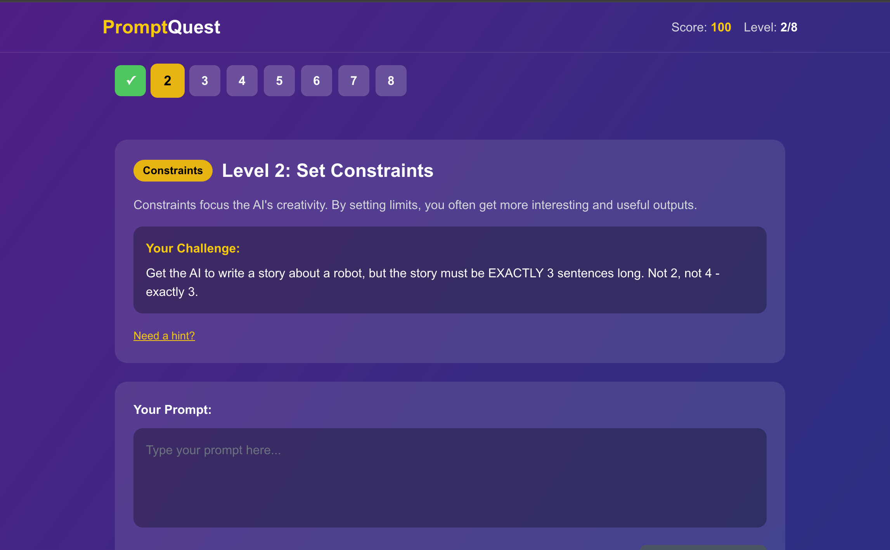

# PromptQuest

An interactive game that teaches prompt engineering techniques through fun challenges. Master AI prompting one level at a time.



## What is this?

PromptQuest turns learning prompt engineering into a game. Each level teaches a specific technique:

1. **Be Specific** - Learn why vague prompts get vague answers
2. **Set Constraints** - Use limits to focus AI creativity
3. **Assign a Role** - Give AI a persona for better responses
4. **Give Examples** - Master few-shot prompting
5. **Think Step by Step** - Chain-of-thought reasoning
6. **Format Your Output** - Control response structure
7. **Provide Context** - Set the scene for relevance
8. **Iterate and Refine** - Perfect your prompts

## How to Run

1. Clone the repository:
```bash
git clone https://github.com/yourusername/prompt-quest.git
cd prompt-quest
```

2. Install dependencies:
```bash
npm install
```

3. Set up your environment variables:
```bash
cp .env.example .env.local
```

4. Add your Gemini API key to `.env.local` (free at [aistudio.google.com](https://aistudio.google.com)):
```
GEMINI_API_KEY=your_gemini_api_key_here
```

5. Run the development server:
```bash
npm run dev
```

6. Open [http://localhost:3000](http://localhost:3000)

## Live Demo

[Link to hosted app will go here]

## Tech Stack

- Next.js 15 (App Router)
- TypeScript
- Tailwind CSS
- Google Gemini API (gemini-1.5-flash)

## How It Works

1. Each level presents a prompting challenge
2. You write a prompt to complete the challenge
3. The AI executes your prompt
4. A judge AI evaluates if you met the success criteria
5. Get feedback and tips to improve
6. Earn points and progress to the next level

## Built For

AI Build Sprint Week 3: Interactive AI Tutorials

---

Built by Jake Strait
